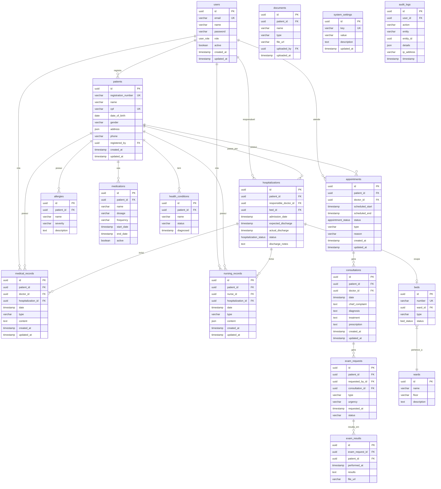

# Esquema do Banco de Dados

Este diagrama representa as principais tabelas do banco de dados e suas relações no sistema SaludoCare Manager.

```mermaid
erDiagram
    %% Tabelas principais
    users ||--o{ patients : registra
    users ||--o{ appointments : atende
    users ||--o{ medical_records : cria
    users ||--o{ nursing_records : cria
    users ||--o{ hospitalizations : responsável
    
    patients ||--o{ appointments : possui
    patients ||--o{ medical_records : possui
    patients ||--o{ nursing_records : possui
    patients ||--o{ hospitalizations : passa_por
    patients ||--o{ allergies : possui
    patients ||--o{ medications : usa
    patients ||--o{ health_conditions : tem
    
    appointments ||--o{ consultations : gera
    consultations ||--o{ exam_requests : gera
    exam_requests ||--o{ exam_results : resulta_em
    
    hospitalizations ||--o| beds : ocupa
    beds }|--|| wards : pertence_a
    
    hospitalizations ||--o{ medical_records : inclui
    hospitalizations ||--o{ nursing_records : inclui
    
    %% Estrutura das tabelas
    users {
        uuid id PK
        varchar email UK
        varchar name
        varchar password
        user_role role
        boolean active
        timestamp created_at
        timestamp updated_at
    }
    
    patients {
        uuid id PK
        varchar registration_number UK
        varchar name
        varchar cpf UK
        date date_of_birth
        varchar gender
        json address
        varchar phone
        uuid registered_by FK
        timestamp created_at
        timestamp updated_at
    }
    
    appointments {
        uuid id PK
        uuid patient_id FK
        uuid doctor_id FK
        timestamp scheduled_start
        timestamp scheduled_end
        appointment_status status
        varchar type
        varchar reason
        timestamp created_at
        timestamp updated_at
    }
    
    consultations {
        uuid id PK
        uuid patient_id FK
        uuid doctor_id FK
        timestamp date
        text chief_complaint
        text diagnosis
        text treatment
        text prescription
        timestamp created_at
        timestamp updated_at
    }
    
    medical_records {
        uuid id PK
        uuid patient_id FK
        uuid doctor_id FK
        uuid hospitalization_id FK
        timestamp date
        varchar type
        text content
        timestamp created_at
        timestamp updated_at
    }
    
    nursing_records {
        uuid id PK
        uuid patient_id FK
        uuid nurse_id FK
        uuid hospitalization_id FK
        timestamp date
        varchar type
        json content
        timestamp created_at
        timestamp updated_at
    }
    
    hospitalizations {
        uuid id PK
        uuid patient_id FK
        uuid responsible_doctor_id FK
        uuid bed_id FK
        timestamp admission_date
        timestamp expected_discharge
        timestamp actual_discharge
        hospitalization_status status
        text discharge_notes
    }
    
    beds {
        uuid id PK
        varchar number UK
        uuid ward_id FK
        varchar type
        bed_status status
    }
    
    wards {
        uuid id PK
        varchar name
        varchar floor
        text description
    }
    
    allergies {
        uuid id PK
        uuid patient_id FK
        varchar name
        varchar severity
        text description
    }
    
    medications {
        uuid id PK
        uuid patient_id FK
        varchar name
        varchar dosage
        varchar frequency
        timestamp start_date
        timestamp end_date
        boolean active
    }
    
    health_conditions {
        uuid id PK
        uuid patient_id FK
        varchar name
        varchar status
        timestamp diagnosed
    }
    
    exam_requests {
        uuid id PK
        uuid patient_id FK
        uuid requested_by_id FK
        uuid consultation_id FK
        varchar type
        varchar urgency
        timestamp requested_at
        varchar status
    }
    
    exam_results {
        uuid id PK
        uuid exam_request_id FK
        uuid patient_id FK
        timestamp performed_at
        text results
        varchar file_url
    }
    
    documents {
        uuid id PK
        uuid patient_id FK
        varchar name
        varchar type
        varchar file_url
        uuid uploaded_by FK
        timestamp uploaded_at
    }
    
    system_settings {
        uuid id PK
        varchar key UK
        varchar value
        text description
        timestamp updated_at
    }
    
    audit_logs {
        uuid id PK
        uuid user_id FK
        varchar action
        varchar entity
        uuid entity_id
        json details
        varchar ip_address
        timestamp timestamp
    }
``` 