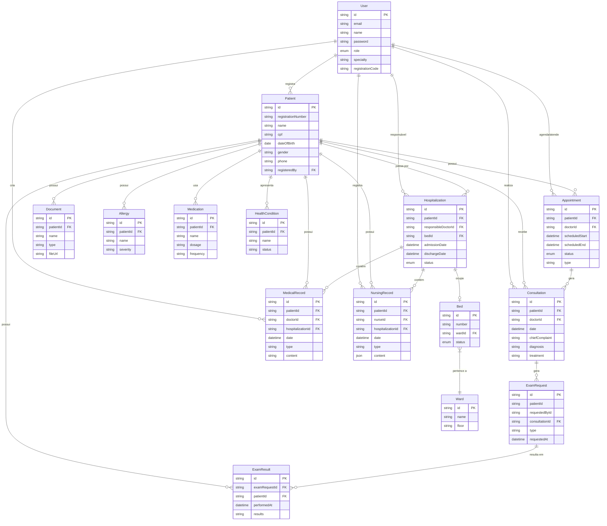

# Diagrama ER do SaludoCare Manager

Este diagrama representa as principais entidades e seus relacionamentos no sistema SaludoCare Manager.

```mermaid
erDiagram
    User ||--o{ Patient : "registra"
    User ||--o{ Appointment : "agenda/atende"
    User ||--o{ Consultation : "realiza"
    User ||--o{ MedicalRecord : "cria"
    User ||--o{ NursingRecord : "registra"
    User ||--o{ Hospitalization : "responsável"
    
    Patient ||--o{ Appointment : "possui"
    Patient ||--o{ Consultation : "recebe"
    Patient ||--o{ MedicalRecord : "possui"
    Patient ||--o{ NursingRecord : "possui"
    Patient ||--o{ Hospitalization : "passa por"
    Patient ||--o{ Document : "possui"
    Patient ||--o{ Allergy : "possui"
    Patient ||--o{ Medication : "usa"
    Patient ||--o{ HealthCondition : "apresenta"
    Patient ||--o{ ExamResult : "possui"
    
    Appointment ||--o{ Consultation : "gera"
    Consultation ||--o{ ExamRequest : "gera"
    ExamRequest ||--o{ ExamResult : "resulta em"
    
    Hospitalization ||--o| Bed : "ocupa"
    Bed }|--|| Ward : "pertence a"
    
    Hospitalization ||--o{ MedicalRecord : "contém"
    Hospitalization ||--o{ NursingRecord : "contém"
    
    User {
        string id PK
        string email
        string name
        string password
        enum role
        string specialty
        string registrationCode
    }
    
    Patient {
        string id PK
        string registrationNumber
        string name
        string cpf
        date dateOfBirth
        string gender
        string phone
        string registeredBy FK
    }
    
    Appointment {
        string id PK
        string patientId FK
        string doctorId FK
        datetime scheduledStart
        datetime scheduledEnd
        enum status
        string type
    }
    
    Consultation {
        string id PK
        string patientId FK
        string doctorId FK
        datetime date
        string chiefComplaint
        string diagnosis
        string treatment
    }
    
    MedicalRecord {
        string id PK
        string patientId FK
        string doctorId FK
        string hospitalizationId FK
        datetime date
        string type
        string content
    }
    
    NursingRecord {
        string id PK
        string patientId FK
        string nurseId FK
        string hospitalizationId FK
        datetime date
        string type
        json content
    }
    
    Hospitalization {
        string id PK
        string patientId FK
        string responsibleDoctorId FK
        string bedId FK
        datetime admissionDate
        datetime dischargeDate
        enum status
    }
    
    Bed {
        string id PK
        string number
        string wardId FK
        enum status
    }
    
    Ward {
        string id PK
        string name
        string floor
    }
    
    ExamRequest {
        string id PK
        string patientId
        string requestedById
        string consultationId FK
        string type
        datetime requestedAt
    }
    
    ExamResult {
        string id PK
        string examRequestId FK
        string patientId FK
        datetime performedAt
        string results
    }
    
    Document {
        string id PK
        string patientId FK
        string name
        string type
        string fileUrl
    }
    
    Allergy {
        string id PK
        string patientId FK
        string name
        string severity
    }
    
    Medication {
        string id PK
        string patientId FK
        string name
        string dosage
        string frequency
    }
    
    HealthCondition {
        string id PK
        string patientId FK
        string name
        string status
    }
``` 