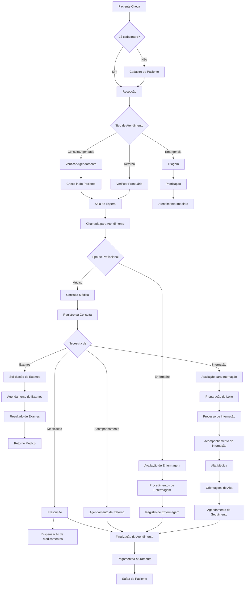

# Fluxo de Atendimento ao Paciente

Este diagrama representa o fluxo completo de atendimento ao paciente no sistema SaludoCare Manager.

```mermaid
flowchart TD
    A[Paciente Chega] --> B{Já cadastrado?}
    B -->|Não| C[Cadastro de Paciente]
    B -->|Sim| D[Recepção]
    C --> D
    
    D --> E{Tipo de Atendimento}
    
    E -->|Consulta Agendada| F[Verificar Agendamento]
    F --> G[Check-in do Paciente]
    G --> H[Sala de Espera]
    
    E -->|Emergência| I[Triagem]
    I --> J[Priorização]
    J --> K[Atendimento Imediato]
    
    E -->|Retorno| L[Verificar Prontuário]
    L --> H
    
    H --> M[Chamada para Atendimento]
    
    M --> N{Tipo de Profissional}
    
    N -->|Médico| O[Consulta Médica]
    O --> P[Registro da Consulta]
    P --> Q{Necessita de}
    
    Q -->|Exames| R[Solicitação de Exames]
    R --> S[Agendamento de Exames]
    S --> T[Resultado de Exames]
    T --> U[Retorno Médico]
    
    Q -->|Medicação| V[Prescrição]
    V --> W[Dispensação de Medicamentos]
    
    Q -->|Internação| X[Avaliação para Internação]
    X --> Y[Preparação de Leito]
    Y --> Z[Processo de Internação]
    
    Q -->|Acompanhamento| AA[Agendamento de Retorno]
    
    N -->|Enfermeiro| AB[Avaliação de Enfermagem]
    AB --> AC[Procedimentos de Enfermagem]
    AC --> AD[Registro de Enfermagem]
    
    V --> AE[Finalização do Atendimento]
    AA --> AE
    AD --> AE
    Z --> AF[Acompanhamento da Internação]
    
    AF --> AG[Alta Médica]
    AG --> AH[Orientações de Alta]
    AH --> AI[Agendamento de Seguimento]
    AI --> AE
    
    AE --> AJ[Pagamento/Faturamento]
    AJ --> AK[Saída do Paciente]
``` 