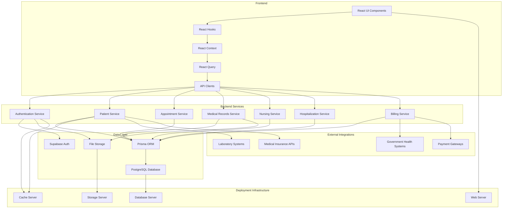
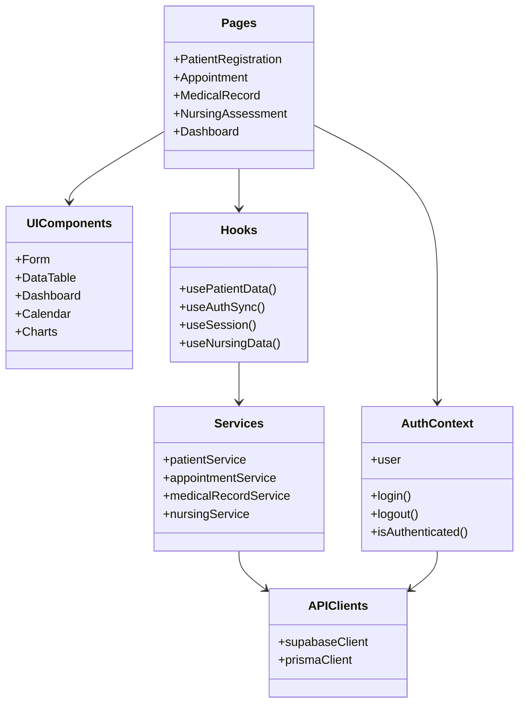

# Arquitetura do Sistema SaludoCare Manager

Este diagrama representa a arquitetura técnica do sistema SaludoCare Manager.

```mermaid
flowchart TD
    subgraph "Frontend"
        A[React UI Components] --> B[React Hooks]
        B --> C[React Context]
        C --> D[React Query]
        D --> E[API Clients]
    end
    
    subgraph "Backend Services"
        F[Authentication Service]
        G[Patient Service]
        H[Appointment Service]
        I[Medical Records Service]
        J[Nursing Service]
        K[Hospitalization Service]
        L[Billing Service]
    end
    
    subgraph "Data Layer"
        M[Supabase Auth]
        N[Prisma ORM]
        O[PostgreSQL Database]
        P[File Storage]
    end
    
    E --> F
    E --> G
    E --> H
    E --> I
    E --> J
    E --> K
    E --> L
    
    F --> M
    G --> N
    H --> N
    I --> N
    J --> N
    K --> N
    L --> N
    
    N --> O
    F --> P
    I --> P
    
    subgraph "Deployment Infrastructure"
        Q[Web Server]
        R[Database Server]
        S[Storage Server]
        T[Cache Server]
    end
    
    A --> Q
    O --> R
    P --> S
    F --> T
    G --> T
    
    subgraph "External Integrations"
        U[Laboratory Systems]
        V[Medical Insurance APIs]
        W[Government Health Systems]
        X[Payment Gateways]
    end
    
    G --> U
    G --> V
    L --> W
    L --> X
```

## Arquitetura da aplicação

```mermaid
classDiagram
    class UIComponents {
        +Form
        +DataTable
        +Dashboard
        +Calendar
        +Charts
    }
    
    class Pages {
        +PatientRegistration
        +Appointment
        +MedicalRecord
        +NursingAssessment
        +Dashboard
    }
    
    class Hooks {
        +usePatientData()
        +useAuthSync()
        +useSession()
        +useNursingData()
    }
    
    class Services {
        +patientService
        +appointmentService
        +medicalRecordService
        +nursingService
    }
    
    class APIClients {
        +supabaseClient
        +prismaClient
    }
    
    class AuthContext {
        +user
        +login()
        +logout()
        +isAuthenticated()
    }
    
    Pages --> UIComponents
    Pages --> Hooks
    Hooks --> Services
    Services --> APIClients
    Pages --> AuthContext
    AuthContext --> APIClients
``` 